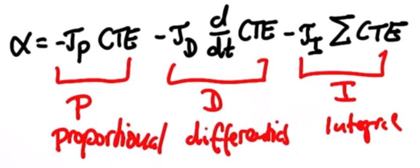

# PID Controller Project:
The goal for this project is to develop a PID controller algorithm for a car to drive around a track in a simulator while staying within the lane. This is done by calculating the steering angle that is proportional to the Cross Track Error (CTE), which is the lateral distance between the car and the reference trajectory. 

The equation for the PID controller is given by:


A PID controller is comprised of three components, the Proportional (P) component, the Integral (I) component, & the D (Derivative component). A brief discussion on the effect of each of these terms on the steering angle ensues below.

### Proportional component: 
The proportional term, when used by itself to calculate the steering angle, sets a steering angle that is proportional to the CTE. However, the end result is a steering angle which oscillates around the reference trajectory. The proportional coefficient (Kp) determines how fast the car oscillates(or overshoots) around the reference trajectory.

### Derivative component: 
The derivative component uses a rate of change of error to reduce the overshoot caused by the proportional component. This derivative coefficient (Kd) term is used to optimize how far the car overshoots (also known as oscillation amplitude) from the reference trajectory.

### Integral component: 
Over time, the steering angle accrues errors due to systematic bias which could drive the car out of the track eventually, but not immediately. The integral component fixes this problem. As this component impacts the error over a period of time, the integral coefficient (Ki) should be carefully optimized in small steps as it has a large impact on the overall performance.

One could manually tune the Kp, Ki & Kd values with trail and error but it would take a lot of time to get the car to drive around the track smoothly. However, this process could be sped up by understanding the dependencies of the Kp, Ki & Kd on each other. By using Ziegler-Nichols technique (https://www.thorlabs.com/tutorials.cfm?tabID=5dfca308-d07e-46c9-baa0-4defc5c40c3e), I used the table below to calculate the Kp, Ki, & Kd terms by choosing only two parameters (Ku & Pu). I set the integral and derivative gain to zero and increased the proportional gain (Ku) until the car starts to oscillate with a period(Pu). 

|   Control Type   |       Kp      |       Ki       |       Kd       |
|:----------------:|:-------------:|:--------------:|:--------------:|
|PID|0.60*Ku|2*Kp/Pu|Kp*Pu/8|

I used the table below to experiment with different values of Ku & Pu to arrive at the final optimal values of Kp, Ki, & Kd.

|   Ku   |   Pu   |    Comments     |
|:----------------:|:-------------:|:----------------------------------------------------------------------------------------:|
|2|100|Wheels turn really fast. Really fast response|
|1|100|Completes a lap but response is still very fast|
|0.5|100|Better than previous but still fast response|
|0.5|75|Better than previous but still fast response|
|0.25|75|Better than previous but could be improved|
|0.25|60|Bigger oscillations but completes lap|
|0.15|75|Completes lap but need to reduce oscillation|
|0.15|80|Much better better but 0.25/75 still best|
|0.25|80|Better but can still reduce oscillation|
|0.25|80|Increased speed (60mph) with same settings. Big oscillations but goes thru 1 lap|
|0.25|90|Laps without crashing but need to damp oscillations|
|0.25|100|Laps without crashing but need to damp oscillations|
|0.2|100|Better than previous. Can damp oscillations further|
|0.19|110|Better than previous. Can damp oscillations further|
|0.17|110|Better than previous. Can damp oscillations further|
|0.15|110|Better than previous. Can damp oscillations further|
|0.14|110|Better than previous. Can damp oscillations further|
|0.14|115|Still need to try and get inside lines on turn 3|
|0.13|115|Goes out of lane|
|0.14|120|Completes laps. Try and get to drive inside lane even further on turn 3|
|0.14|125|Completes laps. Try and get to drive inside lane even further on turn 3|
|0.145|125|Completes laps without a problem. Final solution|

I arrived at the final solution using Ku & Pu of 0.145 & 125 as shown in table above, which translate to the following Kp, Ki & Kd values by using the formulae in the first table:

|   Control Type   |       Kp      |       Ki       |       Kd       |
|:----------------:|:-------------:|:--------------:|:--------------:|
|PID|0.087|0.001392|1.359375|

## Conclusion

My solution works fine for a speed of 60mph which can be observed in the simulator. I am confident that this solution can further be improved at even higher speeds with more tuning. Another point to note is that I used a separate PID instance to control the throttle and maintain a constant speed, which made it easier to tune the parameters.

## Dependencies

* cmake >= 3.5
 * All OSes: [click here for installation instructions](https://cmake.org/install/)
* make >= 4.1(mac, linux), 3.81(Windows)
  * Linux: make is installed by default on most Linux distros
  * Mac: [install Xcode command line tools to get make](https://developer.apple.com/xcode/features/)
  * Windows: [Click here for installation instructions](http://gnuwin32.sourceforge.net/packages/make.htm)
* gcc/g++ >= 5.4
  * Linux: gcc / g++ is installed by default on most Linux distros
  * Mac: same deal as make - [install Xcode command line tools]((https://developer.apple.com/xcode/features/)
  * Windows: recommend using [MinGW](http://www.mingw.org/)
* [uWebSockets](https://github.com/uWebSockets/uWebSockets)
  * Run either `./install-mac.sh` or `./install-ubuntu.sh`.
  * If you install from source, checkout to commit `e94b6e1`, i.e.
    ```
    git clone https://github.com/uWebSockets/uWebSockets 
    cd uWebSockets
    git checkout e94b6e1
    ```
    Some function signatures have changed in v0.14.x. See [this PR](https://github.com/udacity/CarND-MPC-Project/pull/3) for more details.
* Simulator. You can download these from the [project intro page](https://github.com/udacity/self-driving-car-sim/releases) in the classroom.

There's an experimental patch for windows in this [PR](https://github.com/udacity/CarND-PID-Control-Project/pull/3)

## Basic Build Instructions

1. Clone this repo.
2. Make a build directory: `mkdir build && cd build`
3. Compile: `cmake .. && make`
4. Run it: `./pid`. 

Tips for setting up your environment can be found [here](https://classroom.udacity.com/nanodegrees/nd013/parts/40f38239-66b6-46ec-ae68-03afd8a601c8/modules/0949fca6-b379-42af-a919-ee50aa304e6a/lessons/f758c44c-5e40-4e01-93b5-1a82aa4e044f/concepts/23d376c7-0195-4276-bdf0-e02f1f3c665d)


